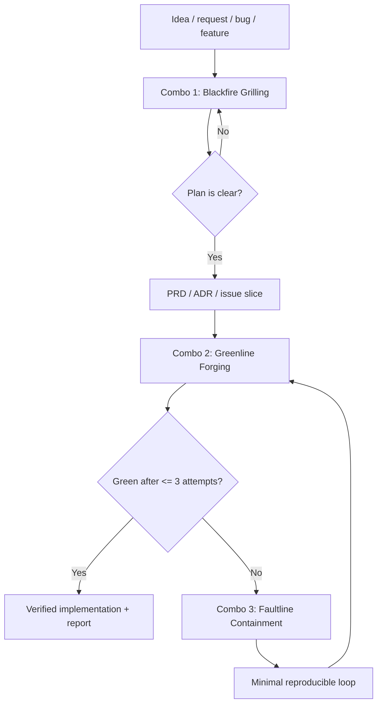
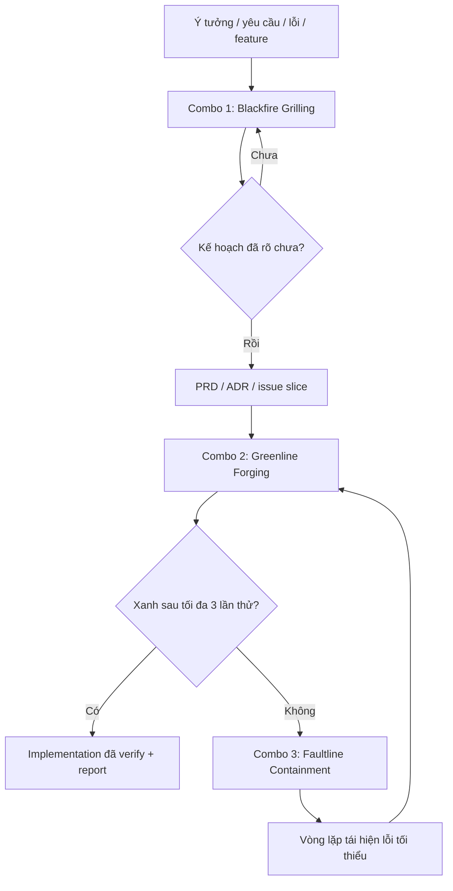

# Workflow Clone Kit

## English Version

## Purpose

This folder is a portable operating kit for running high-discipline AI-assisted software work in any serious project. It extracts the best workflow patterns from a mature AI-assisted codebase without carrying project-specific company structure, team hierarchy, or internal brand doctrine.

Copy this entire folder into another repository when you want every IDE, agent, or human collaborator to work with the same disciplined rhythm:

1. grill the plan before code;
2. build one verified slice at a time;
3. contain hard failures instead of guessing;
4. leave documents that make the next operator smarter.

## Core Principle

> Clarity over noise.

Every artifact should reduce ambiguity. If a plan, test, issue, component, or commit only makes the project look busy, it is noise.

## Folder Contents

| File | Use |
| --- | --- |
| `INSTALL.md` | Step-by-step instructions for wiring this compressed kit into a new repo's front door. |
| `AGENTS-snippet.md` | Copy-paste block for the target repo's root `AGENTS.md`. |
| `skills/01-blackfire-grilling.md` | Planning, PRD, ADR, architecture, privacy, UX, and high-risk decision review. |
| `skills/02-greenline-forging.md` | Feature implementation through small red-green-refactor slices. |
| `skills/03-faultline-containment.md` | Debugging stubborn failures after normal implementation stalls. |
| `templates/prd-template.md` | Standard PRD shape for serious feature/design work. |
| `templates/adr-template.md` | Standard Architecture Decision Record shape. |
| `templates/handoff-template.md` | Completion/handoff report shape for agents and IDEs. |
| `checklists/agent-startup-checklist.md` | What a new agent should read and state before acting. |

## The Three-Combo Workflow



## When To Use Each Combo

Use **Blackfire Grilling** before:

- writing a serious PRD;
- changing architecture;
- touching privacy, analytics, consent, identity, payments, licensing, or AI;
- generating issue batches;
- doing risky UX work;
- rewriting Git history or repo structure;
- accepting a vague “sounds good” plan.

Use **Greenline Forging** when:

- implementing a feature;
- adding a route, API, module, migration, command, service, UI behavior, or integration;
- you can define one observable behavior and one verification command.

Use **Faultline Containment** when:

- three Greenline attempts fail;
- the same error keeps returning;
- browser/CLI/CI disagree;
- a migration, queue, stream, auth flow, or provider integration behaves inconsistently;
- the agent is tempted to keep patching without a reproducer.

## Non-Negotiable Operating Rules

- Read the relevant docs before editing.
- Name the owner and module/surface before implementation.
- Prefer public-interface tests over implementation-detail tests.
- Keep controllers thin; put real logic in services, modules, or domain boundaries.
- Do not create speculative abstractions.
- Do not hide legal, security, privacy, or data risk in technical wording.
- Do not broaden scope to look productive.
- Do not commit generated junk, local secrets, runtime binaries, or build noise.
- Every serious work unit should leave a short report: what changed, how it was verified, what remains risky.

## How To Install In Another Repo

This kit is intentionally compressed. Do not scatter it manually at first. Copy the folder, then expose only the front-door instructions that agents need.

1. Copy `docs/workflow-clone-kit/` into the target repository.
2. Read `docs/workflow-clone-kit/INSTALL.md`.
3. Add the contents of `docs/workflow-clone-kit/AGENTS-snippet.md` to the target repo's root `AGENTS.md`.
4. If the target repo has no `AGENTS.md`, create one at the repository root.
5. Keep the workflow files inside `docs/workflow-clone-kit/` unless the target repo later decides to promote them into a first-class `company/`, `.agents/`, or `docs/agents/` structure.

Minimal root `AGENTS.md` pointer:

```md
For serious planning, use `docs/workflow-clone-kit/skills/01-blackfire-grilling.md`.
For feature implementation, use `docs/workflow-clone-kit/skills/02-greenline-forging.md`.
After three failed implementation attempts or any hard bug, use `docs/workflow-clone-kit/skills/03-faultline-containment.md`.
```

Adapt only the project-specific vocabulary:
   - module paths;
   - test commands;
   - build commands;
   - privacy/legal context;
   - brand or product guardrails.

Do not remove the three-combo sequence. That sequence is the point of the kit.

## Storage Recommendation

Keep this kit inside an application repo only when that repo should be governed by the workflow. If the kit is meant to travel across many projects, keep a canonical copy outside the app repo or in a dedicated workflow repository, then copy it into each target project when needed.

For this reason, the safest default is:

- keep the canonical kit outside the Laravel/application repo;
- copy it into a project only when that project needs the workflow;
- commit it only if future agents in that repo must be forced to read and follow it.

-------------------------

# Workflow Clone Kit

## Phiên Bản Tiếng Việt

## Mục Đích

Thư mục này là bộ quy trình vận hành có thể mang sang dự án khác để làm việc với AI/IDE một cách chặt chẽ. Nó rút tinh hoa từ một codebase đã được vận hành kỹ, nhưng không mang theo cấu trúc công ty, mô hình phòng ban, hoặc doctrine nội bộ riêng.

Copy nguyên thư mục này sang repo khác khi muốn mọi IDE, agent, hoặc người cộng tác làm việc theo cùng một nhịp:

1. nướng kế hoạch trước khi code;
2. build từng lát nhỏ đã kiểm chứng;
3. khoanh vùng lỗi cứng thay vì đoán mò;
4. để lại tài liệu giúp người kế tiếp thông minh hơn.

## Nguyên Tắc Lõi

> Clarity over noise.

Mọi artifact phải làm giảm mơ hồ. Nếu một plan, test, issue, component, hoặc commit chỉ làm dự án trông bận rộn hơn, nó là noise.

## Nội Dung Thư Mục

| File | Dùng Để Làm Gì |
| --- | --- |
| `INSTALL.md` | Hướng dẫn từng bước để cắm bộ kit nén này vào mặt tiền repo mới. |
| `AGENTS-snippet.md` | Block copy-paste cho file `AGENTS.md` ở root repo đích. |
| `skills/01-blackfire-grilling.md` | Review plan, PRD, ADR, architecture, privacy, UX, và quyết định rủi ro cao. |
| `skills/02-greenline-forging.md` | Triển khai feature bằng từng lát red-green-refactor nhỏ. |
| `skills/03-faultline-containment.md` | Debug lỗi cứng sau khi implementation bình thường bị kẹt. |
| `templates/prd-template.md` | Khung PRD chuẩn cho feature/design nghiêm túc. |
| `templates/adr-template.md` | Khung Architecture Decision Record chuẩn. |
| `templates/handoff-template.md` | Khung báo cáo hoàn thành/bàn giao cho agent và IDE. |
| `checklists/agent-startup-checklist.md` | Việc agent mới phải đọc và nói rõ trước khi hành động. |

## Quy Trình Ba Combo



## Khi Nào Dùng Từng Combo

Dùng **Blackfire Grilling** trước khi:

- viết PRD nghiêm túc;
- đổi kiến trúc;
- đụng privacy, analytics, consent, identity, payment, licensing, hoặc AI;
- tạo batch issue;
- làm UX rủi ro cao;
- rewrite Git history hoặc cấu trúc repo;
- chấp nhận một plan nghe hay nhưng còn mơ hồ.

Dùng **Greenline Forging** khi:

- triển khai feature;
- thêm route, API, module, migration, command, service, UI behavior, hoặc integration;
- có thể định nghĩa một hành vi quan sát được và một lệnh verify.

Dùng **Faultline Containment** khi:

- ba lần Greenline đầu vẫn fail;
- cùng một lỗi quay lại liên tục;
- browser/CLI/CI cho kết quả khác nhau;
- migration, queue, stream, auth flow, hoặc provider integration không ổn định;
- agent muốn vá tiếp dù chưa có reproducer.

## Luật Vận Hành Bắt Buộc

- Đọc tài liệu liên quan trước khi sửa.
- Nói rõ owner và module/surface trước khi implement.
- Ưu tiên test qua public interface, tránh test implementation detail.
- Giữ controller mỏng; logic thật nằm trong service, module, hoặc domain boundary.
- Không tạo abstraction suy đoán.
- Không giấu rủi ro pháp lý, bảo mật, privacy, hoặc data dưới thuật ngữ kỹ thuật.
- Không mở rộng scope để trông có vẻ năng suất.
- Không commit file rác sinh tự động, secret local, runtime binary, hoặc build noise.
- Mỗi work unit nghiêm túc phải để lại report ngắn: đã đổi gì, verify thế nào, còn rủi ro gì.

## Cách Mang Sang Repo Khác

Bộ này được thiết kế như một kit nén. Đừng rải nó thủ công ngay từ đầu. Hãy copy nguyên folder, sau đó chỉ đưa phần chỉ dẫn cần thiết ra mặt tiền repo để agent khác biết cách bung ra.

1. Copy `docs/workflow-clone-kit/` sang repository đích.
2. Đọc `docs/workflow-clone-kit/INSTALL.md`.
3. Thêm nội dung của `docs/workflow-clone-kit/AGENTS-snippet.md` vào `AGENTS.md` ở root repo đích.
4. Nếu repo đích chưa có `AGENTS.md`, tạo mới ở root.
5. Giữ workflow files trong `docs/workflow-clone-kit/` trừ khi repo đích quyết định promote nó thành cấu trúc chính thức như `company/`, `.agents/`, hoặc `docs/agents/`.

Pointer tối thiểu trong root `AGENTS.md`:

```md
For serious planning, use `docs/workflow-clone-kit/skills/01-blackfire-grilling.md`.
For feature implementation, use `docs/workflow-clone-kit/skills/02-greenline-forging.md`.
After three failed implementation attempts or any hard bug, use `docs/workflow-clone-kit/skills/03-faultline-containment.md`.
```

Chỉ chỉnh phần vocabulary riêng của dự án:
   - đường dẫn module;
   - lệnh test;
   - lệnh build;
   - ngữ cảnh privacy/legal;
   - guardrail brand hoặc product.

Không xóa trình tự ba combo. Trình tự đó chính là linh hồn của bộ kit.

## Khuyến Nghị Lưu Trữ

Chỉ giữ kit này trong repo ứng dụng khi repo đó thật sự cần bị chi phối bởi workflow này. Nếu kit được dùng như một bộ nghề chung để mang qua nhiều dự án, nên giữ bản gốc ở ngoài repo ứng dụng hoặc trong một repo workflow riêng, rồi copy vào từng dự án khi cần.

Mặc định an toàn nhất là:

- giữ bản gốc của kit ở ngoài repo Laravel/app;
- copy vào dự án nào cần dùng workflow;
- chỉ commit vào repo khi muốn các agent tương lai trong repo đó bắt buộc phải đọc và tuân theo nó.
